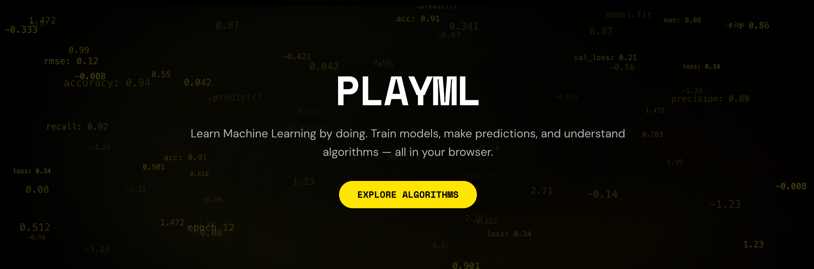
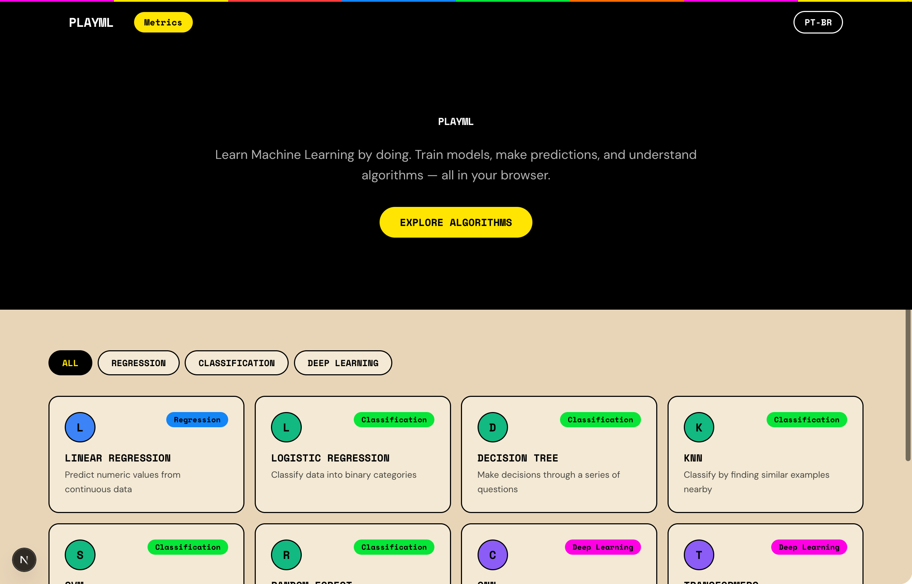
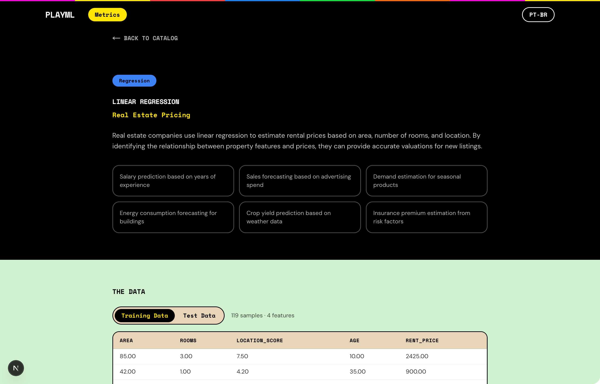
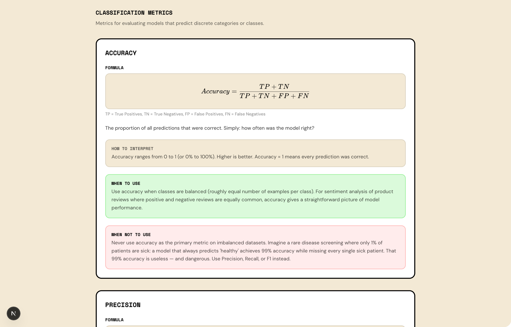

<p align="center">
  <!-- Replace with Neo-Pop styled banner image -->
  
</p>

<p align="center">
  <strong>Learn Machine Learning interactively in your browser</strong>
</p>

<p align="center">
  <a href="#"></a>
  <a href="#license"></a>
  <a href="#"></a>
  <a href="#"></a>
</p>

---

## What is PlayML

PlayML is an interactive, browser-based platform for learning Machine Learning concepts through hands-on visualizations and real-time experimentation. Built with a bold Neo-Pop design system, it makes complex algorithms approachable and fun to explore. Whether you're a student, educator, or curious developer, PlayML lets you see how ML works — not just read about it.

## Key Features

- 🧠 **Interactive Visualizations** — Watch algorithms learn in real time with D3-powered, animated visualizations for each model
- 📊 **9 ML Algorithms** — From Linear Regression to CNNs and Transformers, explore a wide range of supervised and unsupervised methods
- 🎨 **Neo-Pop Design** — A distinctive, vibrant visual identity with bold colors, sharp shadows, and playful UI elements
- 🔢 **Math Under the Hood** — KaTeX-rendered formulas and code views let you understand the theory alongside the visuals
- 🌍 **Multilingual** — Full internationalization support with English and Brazilian Portuguese (pt-BR)
- 📁 **Built-in Datasets** — Experiment with included datasets to see how algorithms behave with different data

## Quick Start

<!-- 🔗 **Try it live:** [play-ml.vercel.app](#) -->

To run locally:

```bash
git clone https://github.com/your-username/play-ml.git
cd play-ml
npm install
npm run dev
```

Open [http://localhost:3000](http://localhost:3000) to start exploring.

## Learning Paths

PlayML covers the following ML concepts, organized from foundational to advanced:

### Regression
- **Linear Regression** — Fitting a line to data, understanding loss functions and gradient descent

### Classification
- **Logistic Regression** — Binary classification with sigmoid functions and decision boundaries
- **K-Nearest Neighbors (KNN)** — Instance-based learning and the effect of K on predictions
- **Support Vector Machines (SVM)** — Margin maximization and kernel methods
- **Decision Trees** — Recursive partitioning and information gain
- **Random Forest** — Ensemble methods and bagging

### Deep Learning
- **Convolutional Neural Networks (CNN)** — Image recognition, convolution layers, and feature maps
- **Transformers** — Attention mechanisms and sequence modeling

### Model Evaluation
- **Metrics** — Accuracy, precision, recall, F1-score, ROC curves, and confusion matrices

> **Prerequisites:** Basic understanding of algebra and statistics is helpful but not required — the visualizations are designed to build intuition from scratch.

## Visual Tour

<p align="center">
  <!-- Replace with actual screenshots -->
  
</p>

<p align="center">
  
</p>

<p align="center">
  
</p>

## Tech Stack

| Technology | Purpose |
|---|---|
| [Next.js 16](https://nextjs.org) | React framework with App Router |
| [React 19](https://react.dev) | UI components |
| [D3.js 7](https://d3js.org) | Data-driven visualizations |
| [TailwindCSS 4](https://tailwindcss.com) | Utility-first styling |
| [next-intl](https://next-intl.dev) | Internationalization (en, pt-BR) |
| [KaTeX](https://katex.org) | LaTeX math rendering |
| ml-knn, ml-cart, ml-regression, ml-svm, ml-random-forest, ml-logistic-regression | ML algorithm implementations |

## Contributing

Contributions are welcome! PlayML is an open-source educational project, and we'd love your help making ML more accessible.

Here's how you can contribute:

1. **Fork** the repository
2. **Create** a feature branch (`git checkout -b feature/my-feature`)
3. **Commit** your changes (`git commit -m 'Add my feature'`)
4. **Push** to the branch (`git push origin feature/my-feature`)
5. **Open** a Pull Request

All skill levels are welcome — whether it's fixing a typo, adding a new algorithm visualization, improving translations, or enhancing the design system.

## Community

<!-- Replace with actual links when available -->
- 💬 [Discussions](https://github.com/your-username/play-ml/discussions) — Ask questions and share ideas
- 🐛 [Issues](https://github.com/your-username/play-ml/issues) — Report bugs or request features

## License

This project is licensed under the [MIT License](LICENSE).

## Acknowledgments

- The ML community for open-source algorithm implementations
- [D3.js](https://d3js.org) for making data visualization accessible
- [Next.js](https://nextjs.org) and [Vercel](https://vercel.com) for the development platform
- All contributors and learners who help improve PlayML
